# Washing Advice

An AI wardrobe and laundry assistant. Photograph your clothes to build a digital
wardrobe, scan their care labels, and get told exactly which loads to run — and
which cycle to select on *your* machine.

> Instead of "wash cold", it says: **Delicates, 30°C, 800 rpm, extra rinse on**
> — and tells you it chose 30°C because your new red tee bleeds.

## TL;DR

- **Photograph your clothes.** The app works out what each one is — type,
  fabric, colour, brand — and keeps it. Take the back too if there is a print
  on it. Adding a whole wardrobe? Photograph the pile first and submit the lot
  in one go, with no waiting between garments.
- **Scan the care label once.** Both sides if it has two, in whatever language
  it is printed in. Photograph it along with the garment and both are read in
  the same pass. Scan it again later and the second reading adds to the first
  rather than replacing it.
- **Say what is dirty.** Four piles — clean, to wash, washing, drying — and
  four ways to move a garment into the wash, including photographing the heap
  on the floor.
- **Get the loads to run.** Not "wash cold" but the programme, temperature and
  spin for *your* machine, with the reason for each choice.
- **Spilled something?** Say what it was and get a step-by-step treatment,
  checked against that garment before you see it.
- **Ask what to wear.** Outfits built from what you own, and — if you ask — a
  model's opinion on top, including which piece your wardrobe is missing.

**The rule the whole thing is built around: no laundry decision is ever made by
a language model.** The AI turns pixels into facts — what this garment is, what
its label says. Every judgement about how to wash it is made by deterministic,
offline, exhaustively tested code, because ruining a wool sweater has no undo.

It runs with no API key and no account. [Jump to running it](#running-it).

| Wardrobe | Four laundry piles | Loads to run | Treat a spill |
|---|---|---|---|
|  | 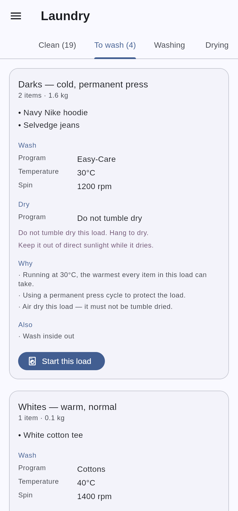 | 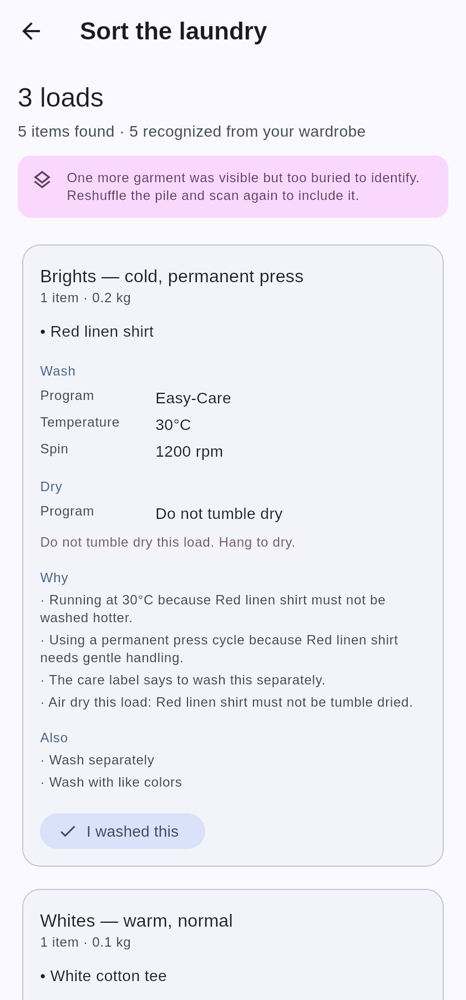 | 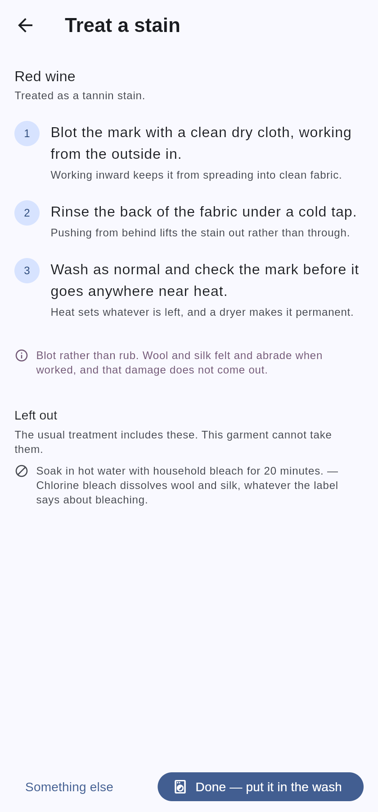 |

| Photograph every side | What the scan found | Collect the label | What the label changed |
|---|---|---|---|
| 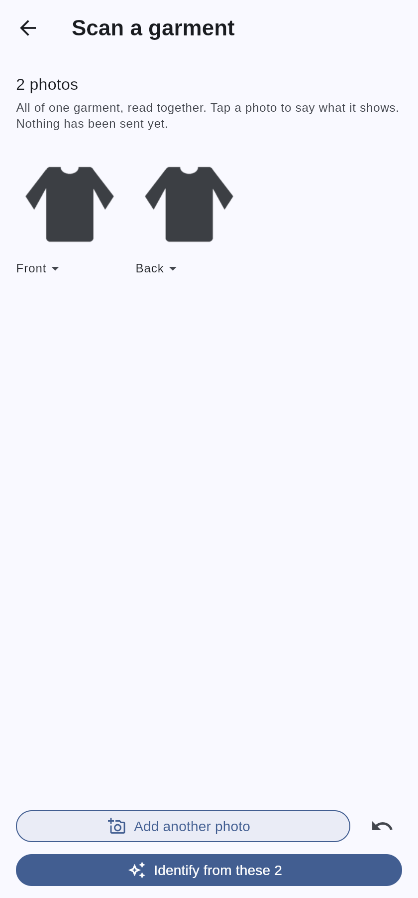 |  | 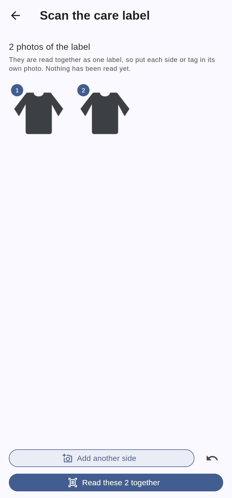 |  |

| Item detail | Tidy the cutout | Edit an item | Insights |
|---|---|---|---|
|  | 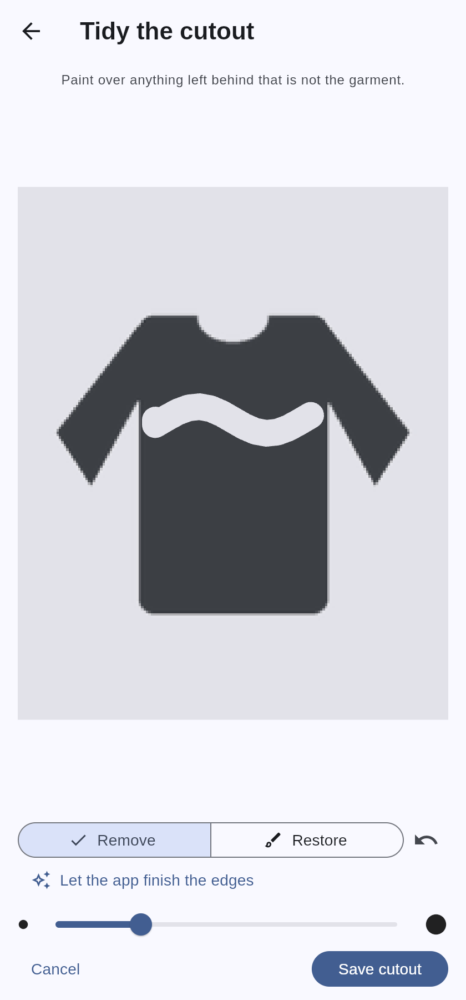 | 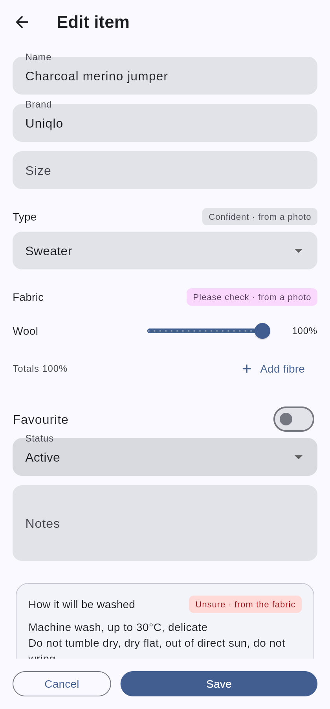 | 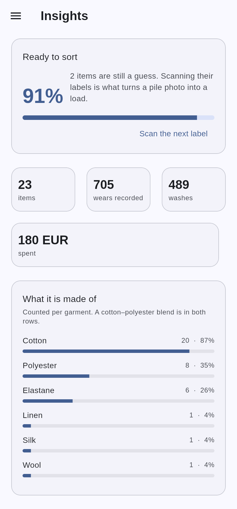 |

| Outfits | Saved outfits | Packing | Settings |
|---|---|---|---|
| 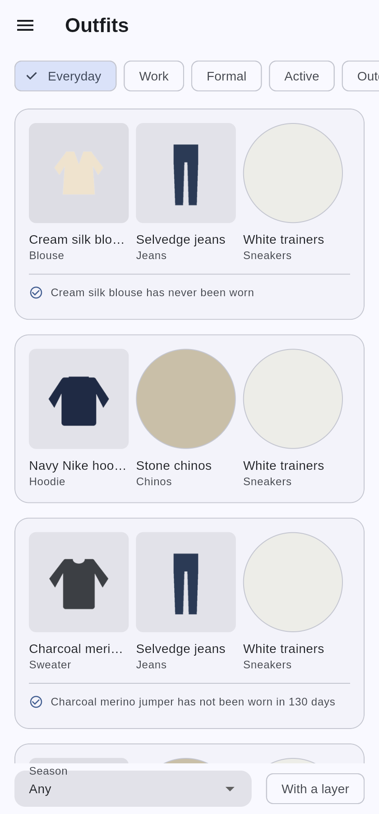 | 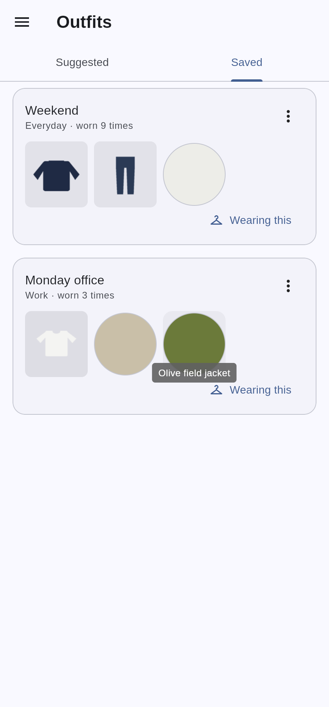 | 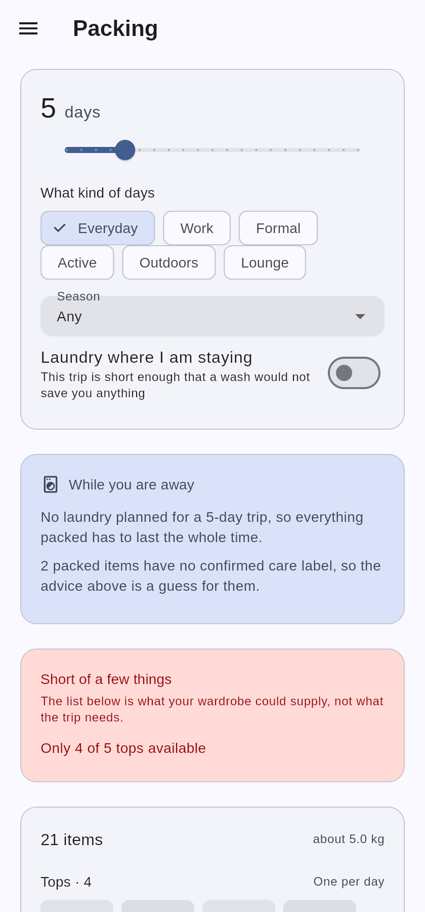 | 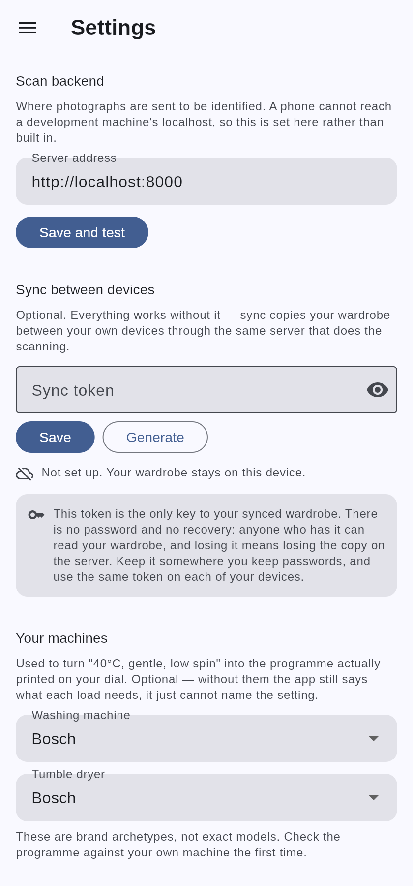 |

| As a list | Wardrobe, dark | Item detail, dark | Insights, dark |
|---|---|---|---|
|  | 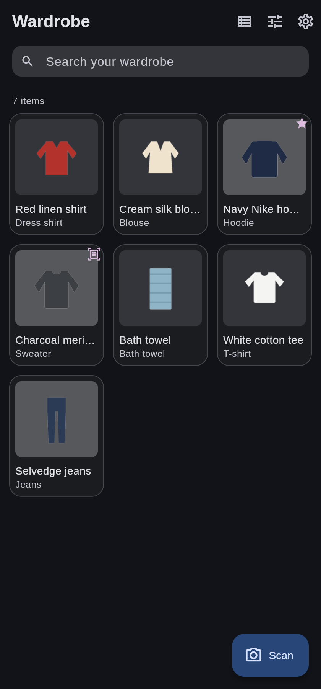 | 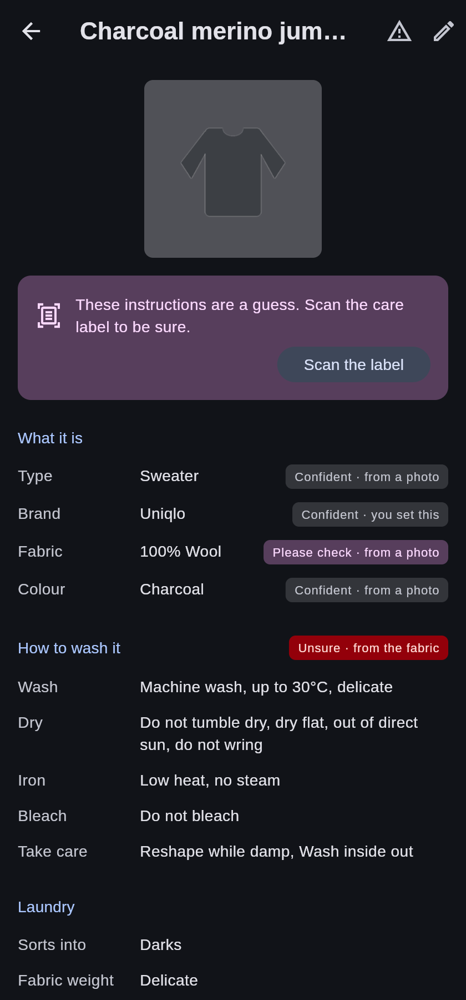 | 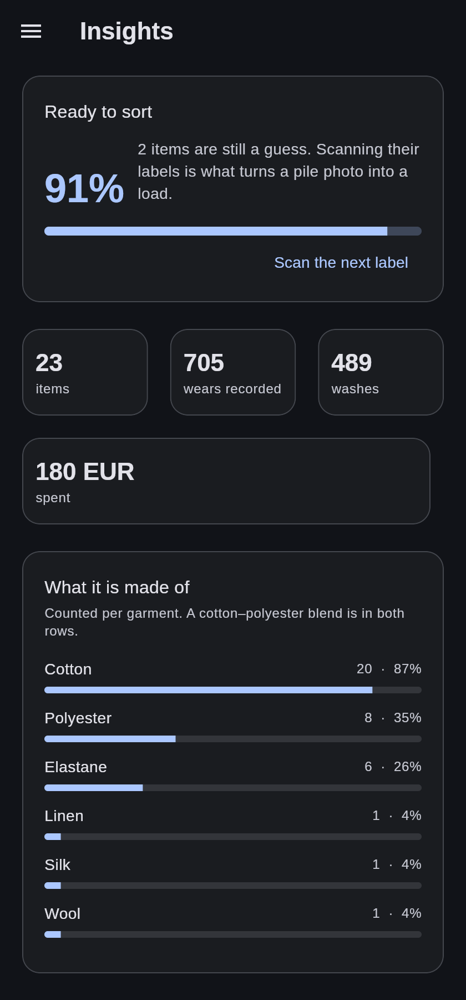 |

These are captures of the real app — a web build of `app/lib/main_demo.dart`,
which is the shipping code with storage, the camera and the backend
substituted. Not mock-ups. `app/tool/screenshots.mjs` drives them, so every
one of them is regenerated from the current build rather than being a picture
of how the app used to look.

---

## What it's for

Most clothing is washed by guesswork. The label is unreadable, or it was cut
out, or it says "wash cold" without saying what that means on a machine whose
programmes are named *Cottons Eco*, *Mix 40* and *Sport*. So people either wash
everything on one middling cycle and slowly wreck the good things, or they sort
by colour and hope.

This app does three things about that.

1. **It remembers what your clothes are made of**, so "can these go in
   together?" has an answer rather than a guess.
2. **It reads care labels once** and keeps them, so a symbol you would have to
   look up becomes a decision you never have to make again.
3. **It translates care requirements into your machine's actual programmes**,
   because "40°C, gentle, low spin" is only useful if you know which dial
   position that is.

### The constraint everything is built around

Ruining a wool sweater is unrecoverable. There is no undo, and the failure is
silent until you pull a child-sized jumper out of the drum.

So **no laundry decision is ever made by a language model.** Every judgement —
what can share a load, at what temperature, on which cycle, and why — is made by
deterministic, offline, exhaustively tested code in `packages/wardrobe_core`.
The AI layer is confined to *perception*: turning pixels into facts. The UI is
confined to *presentation*.

The corollary is that **the app is honest about what it does not know.** A
fabric guessed from a photograph is labelled as a guess, the care derived from
it is labelled as a guess, and the app asks you to scan the label. A fact read
off the manufacturer's own tag is labelled as such and acted on without asking.
Those two look different on screen, because acting on the wrong one shrinks a
jumper.

---

## What it can do

### Build a wardrobe from photographs

Photograph a garment and the app identifies its type, colour, fabric, brand,
pattern and cut, each with a confidence and a stated source. It suggests a name.
Anything it is unsure about is flagged for you to confirm rather than silently
accepted.

**Take as many photographs as the garment needs.** A capture collects rather
than identifying, so you can turn the shirt around before anything is decided —
a plain navy tee and one with a large print across the back are identical from
the front, to you and to the app. Each shot carries what it shows: front, back,
a detail, a logo, a brand tag, guessed by the order you take them and
changeable with a tap. They go up together as one garment, and a print on the
back reaches the name and the description, which is what lets you pick that
shirt out of a drawer of similar ones.

**Adding a whole wardrobe at once.** Photographing forty garments through a
flow that stops to think after each one means forty round trips you have to
stand through. *Several garments* inverts it: photograph one, tap **Next
garment**, carry on through the pile with nothing sent, then submit the lot and
put the phone down. It reports "9 of 40" rather than spinning, and one garment
failing never costs the batch — the ones that could not be read are listed by
number so you know which few to redo. You still see everything before it is
saved, but once for the whole batch rather than once per garment.

Where one garment ends and the next begins is your tap rather than a guess.
Merging two loses a garment outright and splitting one puts a phantom in the
wardrobe, and the tap costs less than either mistake.

Every item's background is removed, so the wardrobe is a wall of garments
floating on the page — browsable by shape and colour before you read a word,
the way you would look along an actual rail. That is not decoration: a grid of
photographs taken on assorted beds and carpets is a patchwork of backgrounds
with clothes somewhere inside it.

A list view is one tap away for when you are comparing rather than hunting, and
it shows the full fabric composition that a grid cell has no room for.

Anything added before the feature existed, or whose background defeated the
remover on the day, can have a cutout made from the photograph already stored —
without re-photographing the garment.

When the remover gets it wrong, you fix it with a finger rather than arguing
with it. **Remove** rubs out what it left behind; **Restore** paints back what
it ate, and paints back the photograph's own pixels rather than a colour, so a
repaired edge carries the garment's real colour.

Then **Let the app finish the edges** hands your rough work back to the
remover. That is not a retry — the remover is deterministic and the same
photograph gives the same wrong answer. It is a second attempt at a *different
picture*: once the bedding and the other clothes are painted away, what it is
given is a garment on an empty field, which is the easy case. Three rules keep
it from making things worse:

- It is sent on an **opaque ground chosen against the garment**, white behind a
  dark one and near-black behind a pale one. Sent with transparency the remover
  flattens it onto black, and a black t-shirt then becomes the same colour as
  the background it is meant to be separated from.
- It may only **subtract**. Its answer is intersected with what is already on
  the canvas, so it can take more away and can never put back what you removed
  by hand — you can see the garment and it cannot.
- A pass that would keep **less than half** of what was visible is refused with
  its reason, because that is a failed segmentation rather than a tidier edge.
  Your own tidying is left exactly as it was.

And when the photograph itself was the problem — the garment held against a
wall its own colour, with a hand and a shadow in shot — no mask rescues it.
**New photo** takes another and asks what the garment is a second time. The
review shows only what the new answer *changes*, and anything you set by hand
survives it: a corrected brand is not reverted because you retook the picture.
The old photograph is kept, in case the second attempt is worse.

### Read care labels

Scan the tag and the app reads the ISO 3758 symbols. The review screen shows
**what the label changed** rather than what it says — because you already have
care instructions, and the useful information is where the manufacturer
disagreed with the rule the app had been applying.

That is how you find out a particular wool jumper is superwash and can go in the
machine at 40°, which is not something you learn by reading a label once and
forgetting it.

**Photograph the label with the garment.** Mark a shot *Care label* while you
are adding a garment and it is read in the same pass — no saving the garment,
reopening it, and starting a second scanner for a tag sewn into the thing you
were still holding. What the manufacturer says then displaces what the fabric
suggested, and the review screen tells you which of the two you are looking at.
A label that comes out blurred does not cost you the garment: it is identified
and saved as usual, and the screen says the label could not be read rather than
letting you assume the real instructions are in hand.

**Labels with more than one side.** Tags are routinely printed on both faces, or
continue onto a second tag sewn behind the first. Photograph each one and they
are read together as a single label. Nothing is read until you say so, so you
can turn the tag over first, and a blurred shot can be dropped without starting
again. Where two photographs contradict each other the lower, safer figure wins
and the disagreement is counted as unreadable — there is no way to tell from a
photograph which of the two was misread.

**Labels in another language.** The symbols are ISO 3758 and mean the same in
every country, so a foreign label is already almost entirely readable — only the
words needed work. `kalt`, `froid`, `frío` and `冷水` all reach the same 30°C;
`laver séparément` and `separat waschen` both reach "wash separately". The app
says which language it read, and shows the wording **exactly as printed** rather
than translating it back at you, because that is what you check the app against
with the tag in your hand.

**Scanning again adds to what you had.** A second reading no longer replaces the
first: what the new photograph shows wins, what it does not show is kept, and
warnings from both accumulate. So photographing the back of a tag weeks later
does not lose the wash symbols off the front. The review names the fields it
carried over rather than read, and offers to use only the new scan if the old
one had it wrong — a merged label is only as trusted as the weaker of its two
halves.

### Get a stain out

Pick a garment, say what was spilled on it, and get an ordered treatment with
the reason for each step. Add a photograph if you are not sure what the mark
is; what you tell it still comes first.

**The advice is checked against that garment before you see it.** The model
proposes a treatment for the substance; `StainSafety` in the core vets every
step against this garment's real care and removes what it forbids, saying which
instruction it broke. A wool jumper is never told to take a chlorine soak —
chlorine hydrolyses protein fibres, so that one holds even when a label says
bleaching is fine, because the label is then wrong. What was left out is shown
rather than silently dropped: "the usual next step is a chlorine soak, and this
garment cannot take it" is genuinely useful, and it is the only way you learn
why your treatment is shorter than the one on the internet.

When nothing is safe to try at home, it says so instead of inventing something
gentler that will not work.

The steps **appear as they are written** rather than after the whole answer is
ready — they come in the order you carry them out, so the first one is readable
while the rest are still arriving, and each is vetted as it lands rather than in
a batch at the end. If the connection drops halfway it says so, instead of
showing you half a treatment as though it were the whole thing.

Finishing one records it in the garment's history and puts it in the wash, and
the load it lands in carries a warning to check that mark before anything goes
near heat — drying sets whatever did not come out.

### Keep track of what is dirty

Every garment sits in one of four piles — **clean**, **to wash**, **washing**,
**drying** — and the Laundry screen moves things between them. The to-wash pile
is not a list: it is run through the same sorting engine as a pile scan, so it
shows the loads to run, the programme and temperature for each, and why.

Four ways in, because the moment you notice something is dirty varies:

- from the garment's own page, one tap;
- **long press** anything in the wardrobe to start picking, tap the rest, and
  send the lot at once — a full basket one garment at a time was never going to
  happen;
- a checkbox when reporting wear, off unless you tick it, since plenty of wear
  is spotted on a hanger and has nothing to do with washing;
- straight from a pile photograph, for the garments it recognised.

And a way back out of each, because things land in the basket by mistake and
jumpers come out of the dryer still damp.

Starting a load moves it into the machine **and records the wash** in the same
action — that record is what "times washed" and every later fading and
shrinkage judgement rest on. Which is also why you cannot drop a garment into
the drum by hand: a move with no record would quietly corrupt the history the
rest of the app reasons from.

### Sort a pile of laundry

Photograph the heap. The app finds each garment, recognises the ones already in
your wardrobe, and groups them into loads with the programme, temperature and
spin to select.

Recognition is the point. A garment lying twisted in a pile is a poor subject;
the same garment photographed properly once, with its care label read, is a
good one. The pile scan only has to work out *which* item it is looking at —
after that it uses what the wardrobe already knows, not what a crumpled sleeve
suggests.

**It refuses to sort what it is guessing at.** A garment it has never seen
before gets a fabric estimated from one photo, and the app will not build a
load on that — it says which items need identifying first. That is the same
rule as everywhere else, applied at the last possible step: the cost of being
wrong is a ruined jumper, and there is no undo.

### Explain itself

Every recommendation carries its reasoning:

```
LOAD 4: Darks (delicates) — cold, hand wash
  • Wool sweater                 70% Wool, 30% Acrylic

  WASH
    Programme:   Hand Wash/Wool
    Temperature: 30°C
    Spin:        600 rpm
    Extra rinse  ON
    i Fill the drum to no more than 40% on this programme —
      gentle cycles cannot move a full drum.
  DRY
    Do not tumble dry
    ⚠ Do not tumble dry this load. Dry flat to keep its shape.
  WHY
    · Running at 30°C because Wool sweater must not be washed hotter.
    · Using a delicate cycle because Wool sweater needs gentle handling.
    · Spin capped at 600 rpm to protect delicate fabrics.
    · Air dry this load: Wool sweater must not be tumble dried.
```

### Notice that clothes age

A care label describes a new garment. Report that something is pilling, fading
or has a loose seam and the app washes it cooler and gentler than the label
says, stops tumble drying it, and drops it a fabric class so it sorts into a
gentler load.

The sheet says what the report will do *before* you make it, and says when it
will do nothing — a broken zip is a repair, not a laundry decision, and slight
fading is worth recording without changing a cycle.

**Or photograph it.** *Check for wear* on any garment reads the places things
actually go — cuffs, elbows, underarms, the seat — and says what it can see.
Nothing is recorded until you agree: each finding is a separate question with
its own yes and no, it tells you where to look so you can check it against the
garment in your hand, and it says when accepting one would change how the thing
is washed. "Nothing to report" is the usual answer and it says so plainly; a
finding it was not sure enough about is dropped, and it tells you that rather
than pretending it saw nothing. Reporting by hand still works — this is the
quick way, not the replacement.

### Correct it

Anything the camera got wrong can be fixed, and a correction outranks every
other source permanently. Changing the fabric re-derives the washing
instructions immediately — a form that let you correct 100% wool to 100% acrylic
while still recommending a wool cycle would be worse than no form at all.

Colour is worth correcting more often than it sounds. A camera reads navy as
black under warm indoor light more often than it should, and the colour decides
which load the garment goes in — so you can set it by hand from named swatches
or a hex code. Name more than one and the first is the one it mostly is, which
is what keeps a white tee with a navy print out of the whites.

A garment whose colour was never recorded says so where it matters: the colour
row offers to set it, and the laundry section admits that "darks" was an
assumption rather than a look at the garment. It lands in darks because that is
the harmless mistake, not because anything examined it.

### Keep a history

Mark a load washed and every garment in it gets an event recorded — with the
programme, temperature and spin actually used, and the machine's name so the
record stays readable after you replace it. Mark an item worn and the same
happens.

That history is the source of truth; the counters on each item are a cache of
it, rebuildable by replay. It is also what makes several things work that
cannot without it: cost per wear has a divisor, "never worn" means something,
and a new red shirt stops being isolated into its own load once it has been
through the machine three times and stopped bleeding.

### Search and filter

By category, colour, fabric, brand, season, favourites, never-worn, or items
still waiting for a label scan — plus free text and six sort orders, including
cost per wear.

### Suggest something to wear

Pick an occasion and get outfits built from what you own and is not currently in
the wash. Every suggestion says why it was made — "opposite colours, which set
each other off", "you have not worn this in 130 days" — because a suggestion
with no explanation is either obeyed blindly or ignored.

Colour is judged in CIELAB hue, which is the opponent space human vision
actually uses rather than the wheel taught in art classes. That means red comes
out opposite cyan, not green, and red with green is scored as the difficult
pairing it is. The thresholds were set from measured garment swatches after the
wheel-derived ones proved wrong, and the tests pin them against named colours.

Suggestions are also deliberately made *different from each other*: ranking by
score alone produced five variations on one outfit, which is one suggestion
shown five times.

**Save** one you like and it is kept under a name, with a count of how often
you actually wear it — the one number a per-garment history cannot produce,
since the log knows the tee and the jeans were worn on the same day but not
that they were worn together *as that outfit*. Saving and wearing are separate
acts, because "keep this" is not "I am wearing it today".

Tap **Wearing this** and every item in the outfit is logged at the same
instant, which the app reads back as one occasion. Pairings that recur become
`wornWith` links, and those links feed the next round of suggestions — so the
app gets better at your wardrobe by being used. The links are *derived* from
the event log rather than stored, which means no second source of truth to keep
in step and no cold start for anyone who has already been logging wears.

The inference is deliberately narrow, because a wrong link is worse than a
missing one: a pair must recur before it counts at all, and the strength is a
conditional rate — "when you wear the blazer, you wear those trousers" — shrunk
toward zero when there is little evidence, so two observations out of two does
not claim the same certainty as twenty out of twenty.

### Ask a model what goes with what

The suggestions above are arithmetic the app can defend line by line. They also
have no opinion on pattern, texture, proportion or formality, and will happily
put a pinstripe with a check because both are navy.

The **Stylist** tab is where that judgement is delegated — the one place in the
app a model's *opinion* is welcome, because nothing here can ruin a garment. A
bad outfit is a bad day. It reads what your wardrobe is made of, not your
photographs, and gives its reasoning in its own words so you can disagree with
it. Its own tab rather than mixed in, because taste and arithmetic are
different things and you are entitled to know which you are reading.

What is *not* delegated is the facts. Every proposal is resolved against the
real wardrobe first: an id it made up, a garment in the wash, two tops at once,
or anything that does not add up to something wearable is refused before you
see it, and the tab says how many were set aside and why.

**What you are missing.** Tick a box and it also names pieces you do not own
that would go with the ones you do — the dark blue jeans a light graphic tee has
been asking for. Each says which of your clothes it goes with, by name. A
suggestion anchored to nothing is dropped, because that is a shopping list
rather than advice, and so is anything already hanging in your wardrobe. No
brands, shops, prices or links: it describes the garment and stops there. Off
unless you ask — plenty of people keep a wardrobe app precisely to buy less.

### Six identical socks are one row

Copies collapse into a single row, because six of them crowd out the garment you
were actually looking for. Tap to open the group, tap again for one of them.

The count still says six, because six is what you own, and picking a group picks
every copy — a bulk move that took one sock and left five in the drawer is the
worst thing this could do. Copies are recognised from facts that were actually
established, so two garments with nothing recorded about them are *not* thereby
the same garment. It is a display decision and nothing else, and it can be
turned off.

### Pack for a trip

Say how long, what kind of days, and whether there is a machine where you are
staying. The quantities are ordinary packing arithmetic — a top a day, a bottom
every three, underwear plus a spare — capped by the wash interval when laundry
is available, which is the difference between a carry-on and a hold bag.

The part a packing app cannot do is the note underneath:

> *2 packed items need hand washing or professional care, which is awkward away
> from home*
>
> *Washing this lot properly means 3 separate loads (whites, darks, brights).
> Dropping one colour would make it fewer.*

And when the wardrobe cannot supply what the trip needs, it says so rather than
handing over a short list that looks complete.

### Know your exact machine, not just its brand

Settings lets you pick from nine seeded brand archetypes — a plausible
programme line-up for that manufacturer's machines in general, labelled
`isVerifiedModel: false` from the start. Or type your machine's exact brand
and model and AI builds its real programme list from its own knowledge of
that specific appliance, once, when you set it up — not on every scan. If it
has no reliable knowledge of that exact machine it says so rather than
inventing programmes, the same honesty rule as everywhere else in this app.
Either way, the result runs through the identical matcher that turns "40°C,
gentle, low spin" into whatever your dial actually calls it.

### Sync between your own devices

Optional, and off until you turn it on — the app is offline-first and stays
fully usable without it.

Reconciliation happens **on the device**, not on the server. Items merge by
provenance, so a scanned care label beats a photo guess whichever arrived
later. Events merge by union, because two phones that each recorded a wash have
each recorded a real wash. Counters are then rebuilt by replaying the combined
log rather than being merged, which is why events are pulled before items are
reconciled.

The server is deliberately a relay that knows nothing about garments. Putting
the merge rules there too would mean maintaining the same subtle logic in two
languages, and the copy that matters is the one that has to work on a train.

There is a suite that starts the real server and drives two independent devices
against it, because that is the only place a cross-language wire break shows up
— both halves pass their own unit tests happily while a renamed field silently
drops data between them. It found two such bugs the first time it ran.

### Show what the wardrobe adds up to

What it is made of, which piles it sorts into, what is never worn as against
merely not worn lately, and cost per wear. Spend is kept per currency and never
converted, because a total built on an invented exchange rate is worse than none
— it looks like an answer.

The figure at the top is **readiness**: the share of washable items the app can
actually advise on. It predicts how useful a pile scan will be before you find
out at the machine, and it links straight to the next label worth scanning.

---

## Where your data lives

On your phone, and nowhere else unless you send it somewhere.

- **The wardrobe** is a SQLite database in the app's own documents directory —
  IndexedDB or OPFS on the web. Photographs and cutouts sit beside it in the
  same private storage. Nothing is uploaded in the background and there is no
  account to sign into.
- **Sync is off** until you turn it on, and it points at a server you run. See
  [Turning on sync](#turning-on-sync), including what the credential is and is
  not.
- **Nothing in this repository is anybody's real wardrobe.** The screenshots are
  a seeded demo build (`app/lib/main_demo.dart`) with invented garments and
  drawn illustrations, generated in a container with no camera.

**What does leave the phone: the photographs you scan.** Identifying a garment,
reading a care label, sorting a pile, removing a background and looking at a
stain all upload that image to the backend named in Settings, which forwards it
to the model provider if a key is configured. The default is `localhost`, so
out of the box the only machine involved is your own; point it at a hosted
server and your photographs go there instead.

The server keeps no wardrobe. It holds a cache keyed by the SHA-256 of an image
so an identical re-scan is not paid for twice, and that cache stores the
*reading* rather than the picture, in memory, bounded, and gone when the process
restarts. The request itself still passes through, which is the thing to weigh
when choosing a backend.

---

## Running it

Three parts, each of which runs independently, and **none of which needs an API
key or an account.**

### The domain core

Pure Dart, zero dependencies. The Dart SDK alone runs the whole suite — no
Flutter, no Android SDK, no emulator.

```sh
cd packages/wardrobe_core
dart pub get
dart test
dart run example/sort_demo.dart   # prints a worked laundry plan
```

### The backend

Python and [uv](https://docs.astral.sh/uv/).

```sh
cd server
uv sync --group dev
uv run pytest
uv run uvicorn app.main:app --reload   # http://localhost:8000/docs
```

The default vision provider is a **deterministic fake** derived from an image
hash, so the service starts and every test passes on a completely empty
environment. Background removal is classical and calls nothing at all.

For real identification, set a [Gemini API key](https://aistudio.google.com/apikey):

```sh
GEMINI_API_KEY=... VISION_PROVIDER=gemini uv run uvicorn app.main:app
```

#### Deploying it

A phone cannot reach a development machine's `localhost`, so a real device
needs the server reachable over the internet. `render.yaml` at the repo root
is a [Render](https://render.com) Blueprint: **New + → Blueprint**, connect
this repo, **Apply**. It provisions a free web service that rebuilds on every
push to `main`, starts with the fake provider so the service is live
immediately, and only needs `GEMINI_API_KEY` set in the Render dashboard to
switch on real identification (`VISION_PROVIDER=gemini` alongside it).

Free-tier services spin down after 15 minutes idle and take up to a minute to
wake back up — a "could not reach the server" on the first scan after a while
away is usually just that; trying again a minute later works.

`CORS_ALLOWED_ORIGINS` controls which browser origins may call the API
(`app/main.py` adds `CORSMiddleware`); it defaults to the project's GitHub
Pages origin, and `http://localhost:*` is always allowed for local
development.

A web build saved to a phone's home screen as a PWA does not reliably notice
a new deployment on its own — Safari's background service-worker checks are
particularly unreliable. **Settings → App updates → Check for updates**
forces a fresh copy from inside the app: it unregisters the service worker,
clears what the browser cached, and reloads — the same result as deleting the
icon and re-adding it, without doing either.

### The app

Flutter. It runs against seeded demo data with no backend at all:

```sh
cd app
flutter pub get
flutter test
flutter run -t lib/main_demo.dart -d chrome   # or any connected device
```

`flutter run` without `-t` starts the real app, which expects the server at
`http://localhost:8000` — editable in Settings, because a phone cannot reach a
development machine's localhost.

### Turning on sync

Sync is off until you configure it, and the app is fully usable without it.

1. Run the server somewhere both devices can reach. It stores synced records in
   `data/sync.db` by default; set `SYNC_DB_PATH` to move it, or `SYNC_ENABLED=false`
   to serve no sync endpoints at all.
2. In the app: **Settings → Sync between devices → Generate**, then **Save**.
3. Copy that same token into the other device and save it there too. The token
   *is* the account — there is no signup.

**Put it behind TLS if it leaves your own network.** The token is a bearer
credential, so anything that can read the traffic can read the wardrobe.

To check the whole thing works, the end-to-end suite starts the real server and
drives two devices against it:

```sh
cd app
flutter test test/sync_e2e_test.dart      # needs `uv` on the PATH
```

---

## How it is built

```
packages/wardrobe_core/   Pure Dart domain core — every laundry decision
server/                   FastAPI perception layer — pixels to confident facts
app/                      Flutter app — presentation only, no laundry logic
contracts/                The wire format, pinned by fixtures both sides parse
docs/ARCHITECTURE.md      The design, and the reasoning behind it
docs/adr/                 Architecture decision records
```

**The core knows nothing about Flutter, HTTP or SQL.** It is a library of domain
types and rules: a normalised care model, a rule table, a sorting engine,
machine profiles, an event log. Everything else depends on it and it depends on
nothing.

**The backend knows nothing about laundry.** It identifies garments, reads
labels, finds items in a pile of clothes and removes backgrounds. It never
decides how to wash anything.

**The app knows nothing about either.** It renders what the core decides and
posts images to the server, and every boundary between them is an interface —
which is why the whole thing can be tested, and screenshotted, without a camera,
a database or a network.

A few decisions worth reading about:

- [Care data is normalised, not stored as text](docs/adr/0002-normalised-care-model.md) —
  you cannot sort laundry by comparing `"Cold"` with `"cold wash"`, but you can
  compare `maxTempC: 30` with `maxTempC: 40`.
- [A typed rule table, not a rules engine](docs/adr/0003-typed-rule-table.md) —
  and why constraints that can only *tighten* make the outcome independent of
  rule order.
- [A scanned label overrides a generic fibre rule](docs/adr/0004-label-overrides-rules.md) —
  the superwash wool problem.
- [Events are the source of truth](docs/adr/0005-events-as-source-of-truth.md).
- [A cost-ordered vision pipeline](docs/adr/0007-cost-ordered-vision-pipeline.md) —
  memory first, on-device next, a paid model last.
- [App layering and the capture seam](docs/adr/0008-app-layering-and-the-capture-seam.md).

---

## Status

| # | Scope | Status |
|---|---|---|
| 1 | Domain core: care model, sorting engine, machine translation, matching, events | **Done** — 593 core tests |
| 2 | FastAPI backend, AI orchestrator, Gemini provider, knowledge cache, cutouts, machine identification | **Done** — 325 tests |
| 3 | Flutter app: wardrobe, item detail, scan flow, Drift storage | **Done** — 584 app tests |
| 4 | Care-label scanning, item editing, filter sheet, garment cutouts, grid view | **Done** |
| 5 | Pile scanning, load grouping, machine profiles, wear and wash history | **Done** |
| 6 | Outfit suggestions, laundry-aware packing, wardrobe insights | **Done** |
| 6a | Closing the loop: wears recorded become links the builder learns from | **Done** |
| 6b | Saving outfits under a name, with their own wear counts | **Done** |
| 7 | Offline verification, provenance-based sync engine | **Done** |
| 7a | Sync endpoints, HTTP client, and a two-device test against the real server | **Done** |
| 8 | Hand-painted cutout masks, rescanning a misread garment, manual colour entry | **Done** |
| 9 | Four laundry piles, the loads to run from the basket, four ways in and out | **Done** |
| 10 | Stain treatment: proposed by a model, vetted by the core, streamed as written | **Done** |
| 11 | Care labels from several photographs, in any language, merged across scans | **Done** |
| 12 | Garments photographed from every side, with what each shot shows | **Done** |
| 13 | Identical garments collapsed into one row, derived rather than stored | **Done** |
| 14 | The Stylist tab: a model's outfit ideas, vetted against the real wardrobe | **Done** |
| 15 | Wear detected from photographs, proposed as questions rather than recorded | **Done** |
| 16 | Naming the pieces a wardrobe does not have, without becoming shopping | **Done** |
| 17 | The care label read from the same photographs as the garment | **Done** |
| 18 | A whole pile photographed first and submitted in one go | **Done** |

Released as `0.18.1 — Button Up`; the app's own **Settings → What's new**
carries the full list, and `app/lib/features/settings/patch_notes.dart` records
which version digit moves for what.

`dart analyze --fatal-infos`, `flutter analyze --fatal-infos`, `ruff`, `mypy
--strict` and every formatter run clean in CI, on all three parts.

This is a working repository, not a released product: everything above runs, and
nothing has been published to an app store.

---

## What it does not do yet

Stated plainly, because the code says so too.

- **Machine profiles, seeded or AI-identified, are still not verified against
  a manual.** A seeded brand archetype is flagged `isVerifiedModel: false`
  from the start; an AI-identified exact model is only as good as its own
  knowledge of that appliance. Both are meant to be corrected the first time
  a programme does not match the dial.
- **The Gemini provider has never run against the live API.** It is written to
  the documented interface and tested with a stubbed transport, which proves the
  code does what it was written to do and says nothing about whether the API
  agrees. Only a key settles that:

  ```sh
  cd server
  GEMINI_API_KEY=... uv run python -m tools.smoke_gemini
  ```

  It exercises all three stages and reports which the API accepted. The key is
  read from the environment and never printed, and no error path echoes a
  response body — those can contain the image that was sent.
- **No photograph has been taken on a physical device.** The app opens the
  phone's own camera (`ImageSource.camera`), iOS and Android are both declared
  for it, and the refusal paths are tested — but a container has no camera, so
  the happy path is unverified until someone runs it on a handset. That is the
  one thing here that needs hardware rather than code.
- **Background removal assumes a plain background.** It measures distance from
  the colours at the frame's border, which handles a garment on a bed or a table
  and will not handle one on a patterned rug. A learned matting model is the
  upgrade, and the remover sits behind an interface so one can be dropped in.
  Until then there are two fallbacks — paint it out by hand, then hand the rough
  result back for a second pass — and both are fixes rather than cures.
- **The demo cutouts are of drawn shapes, not photographs.** There are no
  garments in a build container. The *cutouts* are genuine output from the
  shipping remover; the things it was run on are illustrations.
- **Item matching cannot distinguish visually identical garments.** Three
  identical black t-shirts all match each other, which is why the matcher
  returns ranked candidates and the app asks rather than guessing. This one is
  not fixable by looking harder — the garments really are identical — which is
  why the answer was to stop needing the answer; see grouping below.
- **The wardrobe groups them instead.** Six identical socks are one row, which
  is the answer to the line above: the matcher's problem stops mattering once
  the app is not trying to tell copies apart. Copies are recognised from facts
  that were actually established — type, brand, size, composition, colour — and
  derived on the way to the screen rather than stored, so being wrong costs one
  tap and no data. Two garments with nothing recorded about them are *not*
  thereby the same garment, and it can be turned off.
- **The knowledge cache recognises an identical image, not the same label
  re-photographed** from a different angle. That needs embeddings.
- **A pile scan cannot sort garments the app has not met.** By design — it says
  which ones need identifying — but it does mean the feature is worth little
  until a wardrobe has been built up.
- **Occasion suitability is a default table, not a judgement about you.**
  Whether a hoodie belongs at work depends on the workplace, so the defaults are
  overridable per item with a tag — but nothing yet learns them from what you
  actually wear, even though the log now records which occasion each wear was
  for.
- **Co-wear links need history to exist.** A new wardrobe has none, so early
  suggestions rest on colour and usage alone. That is the designed behaviour
  rather than a failure state, but it does mean the feature is at its weakest
  exactly when someone first tries it.
- **The built outfit suggestions score colour only.** They have no opinion on
  pattern, texture, proportion or fit, which is why every card shows its
  reasoning rather than presenting a verdict. The Stylist tab is where that
  judgement is asked for instead, and it is somebody else's taste rather than
  something the app can defend.
- **Packing weights are typical dry weights for the garment type**, not for your
  particular coat. Useful for comparing two packing lists; not for an airline's
  scales.
- **Nothing rescans a care label automatically** — deliberately, because labels
  do not change. What changes is the garment, and that is both reportable and
  now detectable: photograph the places things wear and the app says what it can
  see, though it only ever asks rather than recording.
- **Wear detection is a second opinion, not an inspection.** It sees what a
  photograph shows, which is not the same as what a garment is doing. Findings
  below a confidence floor are dropped rather than shown, so it is quieter than
  a careful look and deliberately so — a feature that cried pilling at shadows
  is one people learn to ignore, and then they miss the real one.
- **Embeddings and the on-device OCR stage are modelled but not implemented.**
  The types and seams exist; those two stages do not.
- **"You already own this" is only as good as your colour names.** The check
  that stops the Stylist suggesting jeans you have compares colour *words*, so a
  garment whose colour was never named blocks nothing — silence is not sameness,
  the same rule the duplicate grouping follows. It errs towards showing a
  suggestion, which costs a glance, rather than hiding a good one.
- **Bulk adding needs you to say where each garment ends.** Nothing infers it
  from the photographs, and nothing is going to until getting it wrong costs
  less than a tap does.
- **The Stylist's "what I am missing" box is not remembered** between launches.
  It is session state rather than a saved setting.
- **The web build has never been used in anger.** It persists now — images live
  in a small database of their own that Drift keeps in IndexedDB or OPFS — but
  the target is phones, and the browser build exists mainly for trying the app
  and taking these screenshots.
- **Sync has no hosted deployment.** The endpoints, the client and the
  reconciliation all exist and are exercised end to end against a real server in
  CI, but nobody is running that server anywhere. You point the app at your own.
- **The sync credential is a capability token, not an account.** No password, no
  recovery, no revocation, and whoever holds it can read that wardrobe. This is
  written on the settings screen rather than buried here, because assuming an
  account is the natural mistake and the cost of it is someone's data.
- **The server cannot reject nonsense.** It stores opaque JSON keyed by id and
  has no opinion about garments, which is what keeps the domain in one language.
  That is right while every client is this codebase and wrong the moment a third
  party can write to it.

---

## Licence

Not yet chosen. The bundled Liberation Sans font is
[SIL OFL 1.1](https://scripts.sil.org/OFL); see `app/assets/fonts/README.md`.
