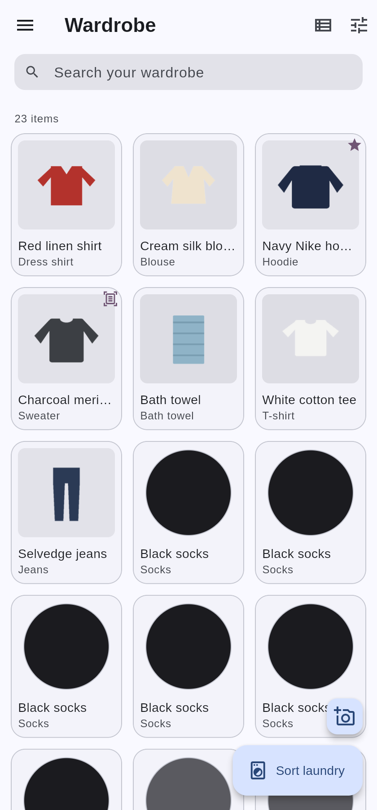
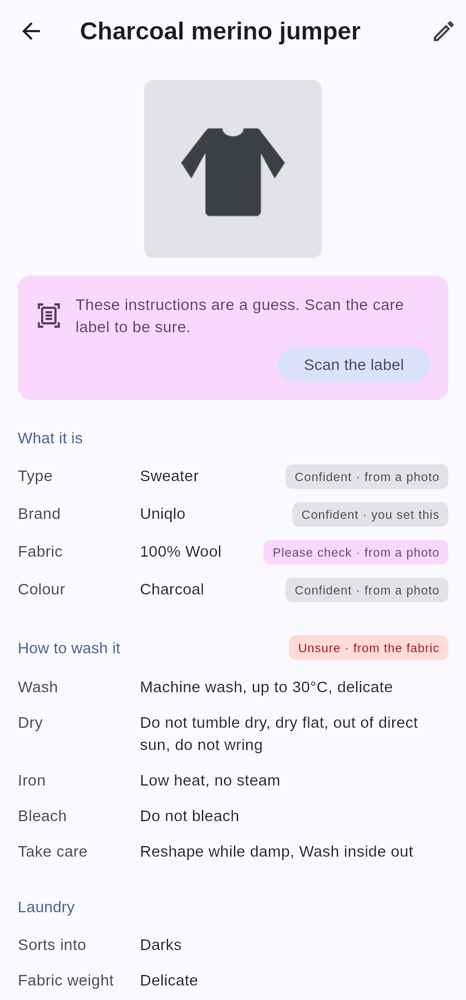
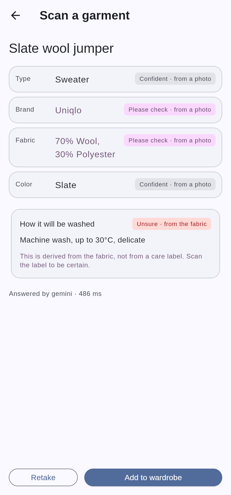
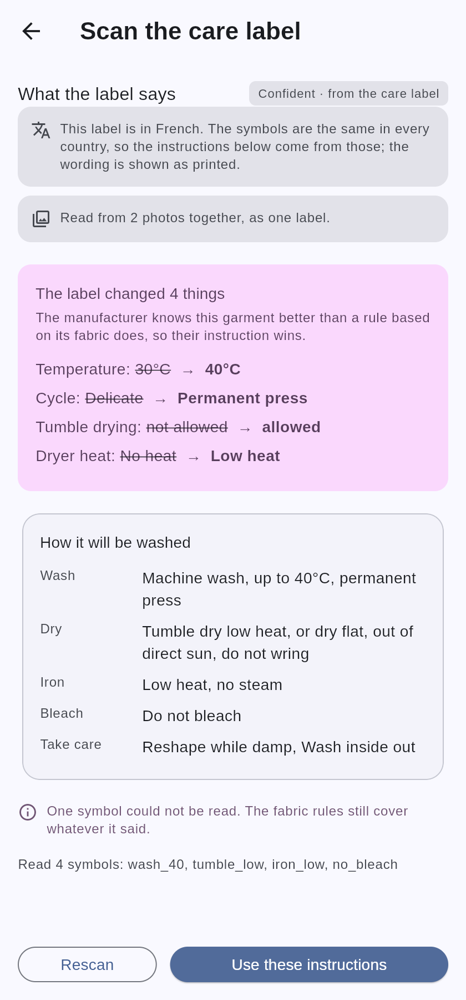

# Washing Advice

An AI wardrobe and laundry assistant. Photograph your clothes to build a digital
wardrobe, scan their care labels, and get told exactly which loads to run — and
which cycle to select on *your* machine.

> Instead of "wash cold", it says: **Delicates, 30°C, 800 rpm, extra rinse on**
> — and tells you it chose 30°C because your new red tee bleeds.

| Wardrobe | Item detail | Scan review | Care label |
|---|---|---|---|
|  |  |  |  |

These are captures of the real app — a web build of `app/lib/main_demo.dart`,
which is the shipping code with storage, the camera and the backend
substituted. Not mock-ups.

---

## What it's for

Most clothing is washed by guesswork. The label is unreadable, or it was cut
out, or it says "wash cold" without saying what that means on a machine whose
programmes are named *Cottons Eco*, *Mix 40* and *Sport*. So people either wash
everything on one middling cycle and slowly wreck the good things, or they sort
by colour and hope.

This app does three things about that.

1. **It remembers what your clothes are made of**, so "can these go in
   together?" has an answer rather than a guess.
2. **It reads care labels once** and keeps them, so a symbol you would have to
   look up becomes a decision you never have to make again.
3. **It translates care requirements into your machine's actual programmes**,
   because "40°C, gentle, low spin" is only useful if you know which dial
   position that is.

### The constraint everything is built around

Ruining a wool sweater is unrecoverable. There is no undo, and the failure is
silent until you pull a child-sized jumper out of the drum.

So **no laundry decision is ever made by a language model.** Every judgement —
what can share a load, at what temperature, on which cycle, and why — is made by
deterministic, offline, exhaustively tested code in `packages/wardrobe_core`.
The AI layer is confined to *perception*: turning pixels into facts. The UI is
confined to *presentation*.

The corollary is that **the app is honest about what it does not know.** A
fabric guessed from a photograph is labelled as a guess, the care derived from
it is labelled as a guess, and the app asks you to scan the label. A fact read
off the manufacturer's own tag is labelled as such and acted on without asking.
Those two look different on screen, because acting on the wrong one shrinks a
jumper.

---

## What it can do

### Build a wardrobe from photographs

Photograph a garment and the app identifies its type, colour, fabric, brand,
pattern and cut, each with a confidence and a stated source. It suggests a name.
Anything it is unsure about is flagged for you to confirm rather than silently
accepted.

Every item's background is removed, so the wardrobe is a wall of garments
floating on the page — browsable by shape and colour before you read a word,
the way you would look along an actual rail. That is not decoration: a grid of
photographs taken on assorted beds and carpets is a patchwork of backgrounds
with clothes somewhere inside it.

A list view is one tap away for when you are comparing rather than hunting, and
it shows the full fabric composition that a grid cell has no room for.

Anything added before the feature existed, or whose background defeated the
remover on the day, can have a cutout made from the photograph already stored —
without re-photographing the garment.

### Read care labels

Scan the tag and the app reads the ISO 3758 symbols. The review screen shows
**what the label changed** rather than what it says — because you already have
care instructions, and the useful information is where the manufacturer
disagreed with the rule the app had been applying.

That is how you find out a particular wool jumper is superwash and can go in the
machine at 40°, which is not something you learn by reading a label once and
forgetting it.

### Explain itself

Every recommendation carries its reasoning:

```
LOAD 4: Darks (delicates) — cold, hand wash
  • Wool sweater                 70% Wool, 30% Acrylic

  WASH
    Programme:   Hand Wash/Wool
    Temperature: 30°C
    Spin:        600 rpm
    Extra rinse  ON
    i Fill the drum to no more than 40% on this programme —
      gentle cycles cannot move a full drum.
  DRY
    Do not tumble dry
    ⚠ Do not tumble dry this load. Dry flat to keep its shape.
  WHY
    · Running at 30°C because Wool sweater must not be washed hotter.
    · Using a delicate cycle because Wool sweater needs gentle handling.
    · Spin capped at 600 rpm to protect delicate fabrics.
    · Air dry this load: Wool sweater must not be tumble dried.
```

### Correct it

Anything the camera got wrong can be fixed, and a correction outranks every
other source permanently. Changing the fabric re-derives the washing
instructions immediately — a form that let you correct 100% wool to 100% acrylic
while still recommending a wool cycle would be worse than no form at all.

### Search and filter

By category, colour, fabric, brand, season, favourites, never-worn, or items
still waiting for a label scan — plus free text and six sort orders, including
cost per wear.

---

## Running it

Three parts, each of which runs independently, and **none of which needs an API
key or an account.**

### The domain core

Pure Dart, zero dependencies. The Dart SDK alone runs the whole suite — no
Flutter, no Android SDK, no emulator.

```sh
cd packages/wardrobe_core
dart pub get
dart test
dart run example/sort_demo.dart   # prints a worked laundry plan
```

### The backend

Python and [uv](https://docs.astral.sh/uv/).

```sh
cd server
uv sync --group dev
uv run pytest
uv run uvicorn app.main:app --reload   # http://localhost:8000/docs
```

The default vision provider is a **deterministic fake** derived from an image
hash, so the service starts and every test passes on a completely empty
environment. Background removal is classical and calls nothing at all.

For real identification, set a [Gemini API key](https://aistudio.google.com/apikey):

```sh
GEMINI_API_KEY=... VISION_PROVIDER=gemini uv run uvicorn app.main:app
```

### The app

Flutter. It runs against seeded demo data with no backend at all:

```sh
cd app
flutter pub get
flutter test
flutter run -t lib/main_demo.dart -d chrome   # or any connected device
```

`flutter run` without `-t` starts the real app, which expects the server at
`http://localhost:8000` — editable in Settings, because a phone cannot reach a
development machine's localhost.

---

## How it is built

```
packages/wardrobe_core/   Pure Dart domain core — every laundry decision
server/                   FastAPI perception layer — pixels to confident facts
app/                      Flutter app — presentation only, no laundry logic
contracts/                The wire format, pinned by fixtures both sides parse
docs/ARCHITECTURE.md      The design, and the reasoning behind it
docs/adr/                 Architecture decision records
```

**The core knows nothing about Flutter, HTTP or SQL.** It is a library of domain
types and rules: a normalised care model, a rule table, a sorting engine,
machine profiles, an event log. Everything else depends on it and it depends on
nothing.

**The backend knows nothing about laundry.** It identifies garments, reads
labels, finds items in a pile of clothes and removes backgrounds. It never
decides how to wash anything.

**The app knows nothing about either.** It renders what the core decides and
posts images to the server, and every boundary between them is an interface —
which is why the whole thing can be tested, and screenshotted, without a camera,
a database or a network.

A few decisions worth reading about:

- [Care data is normalised, not stored as text](docs/adr/0002-normalised-care-model.md) —
  you cannot sort laundry by comparing `"Cold"` with `"cold wash"`, but you can
  compare `maxTempC: 30` with `maxTempC: 40`.
- [A typed rule table, not a rules engine](docs/adr/0003-typed-rule-table.md) —
  and why constraints that can only *tighten* make the outcome independent of
  rule order.
- [A scanned label overrides a generic fibre rule](docs/adr/0004-label-overrides-rules.md) —
  the superwash wool problem.
- [Events are the source of truth](docs/adr/0005-events-as-source-of-truth.md).
- [A cost-ordered vision pipeline](docs/adr/0007-cost-ordered-vision-pipeline.md) —
  memory first, on-device next, a paid model last.
- [App layering and the capture seam](docs/adr/0008-app-layering-and-the-capture-seam.md).

---

## Status

| # | Scope | Status |
|---|---|---|
| 1 | Domain core: care model, sorting engine, machine translation, matching, events | **Done** — 311 tests |
| 2 | FastAPI backend, AI orchestrator, Gemini provider, knowledge cache, cutouts | **Done** — 130 tests |
| 3 | Flutter app: wardrobe, item detail, scan flow, Drift storage | **Done** — 81 tests |
| 4 | Care-label scanning, item editing, filter sheet, garment cutouts, grid view | **Done** |
| 5 | Pile scanning and load grouping | Next |
| 6 | Outfits, packing, analytics | |
| 7 | Offline sync, Supabase, store preparation | |

`dart analyze --fatal-infos`, `flutter analyze --fatal-infos`, `ruff`, `mypy
--strict` and every formatter run clean in CI, on all three parts.

This is a working repository, not a released product: everything above runs, and
nothing has been published to an app store.

---

## What it does not do yet

Stated plainly, because the code says so too.

- **Machine profiles are brand archetypes, not model-exact.** Every seeded
  profile is flagged `isVerifiedModel: false` and is meant to be corrected.
- **The Gemini provider has never run against the live API.** It is written to
  the documented interface and tested with a stubbed transport, but no real
  request has been made. It stays behind the provider registry until it has been
  smoke-tested with a key.
- **The camera has only been exercised through a web file picker.** It sits
  behind an interface precisely so everything downstream is tested, but no
  photograph has been taken on a physical device.
- **Background removal assumes a plain background.** It measures distance from
  the colours at the frame's border, which handles a garment on a bed or a table
  and will not handle one on a patterned rug. A learned matting model is the
  upgrade, and the remover sits behind an interface so one can be dropped in.
- **The demo cutouts are of drawn shapes, not photographs.** There are no
  garments in a build container. The *cutouts* are genuine output from the
  shipping remover; the things it was run on are illustrations.
- **Item matching cannot distinguish visually identical garments.** Three
  identical black t-shirts all match each other, which is why the matcher
  returns ranked candidates and the app asks rather than guessing.
- **The knowledge cache recognises an identical image, not the same label
  re-photographed** from a different angle. That needs embeddings.
- **Nothing rescans a care label automatically.** Once stored, the app trusts it
  indefinitely, including after the garment has visibly aged.
- **Condition detection, embeddings and the on-device OCR stage are modelled but
  not implemented.** The types and seams exist; the detection does not.
- **The web build keeps images in memory**, so a browser reload loses them.
  Acceptable for trying the app; a phone writes real files.

---

## Licence

Not yet chosen. The bundled Liberation Sans font is
[SIL OFL 1.1](https://scripts.sil.org/OFL); see `app/assets/fonts/README.md`.
